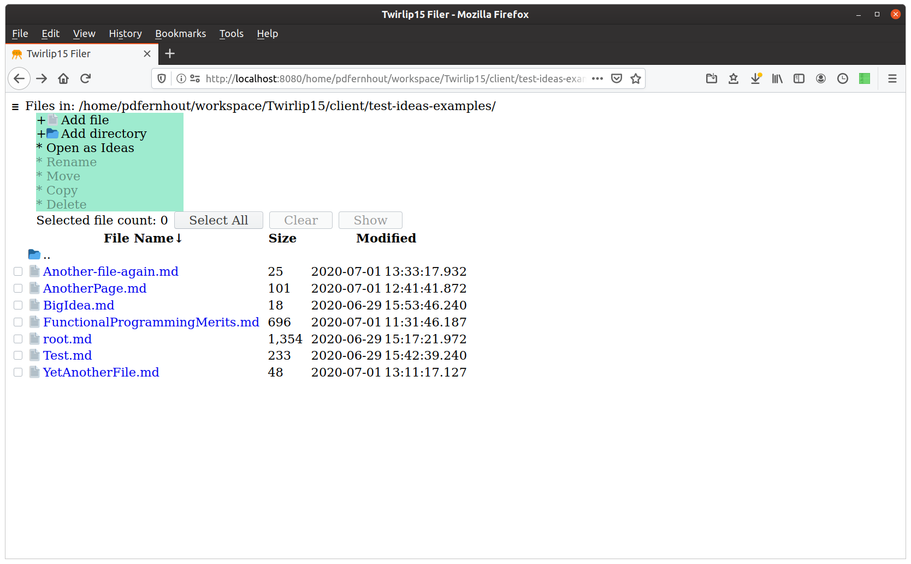
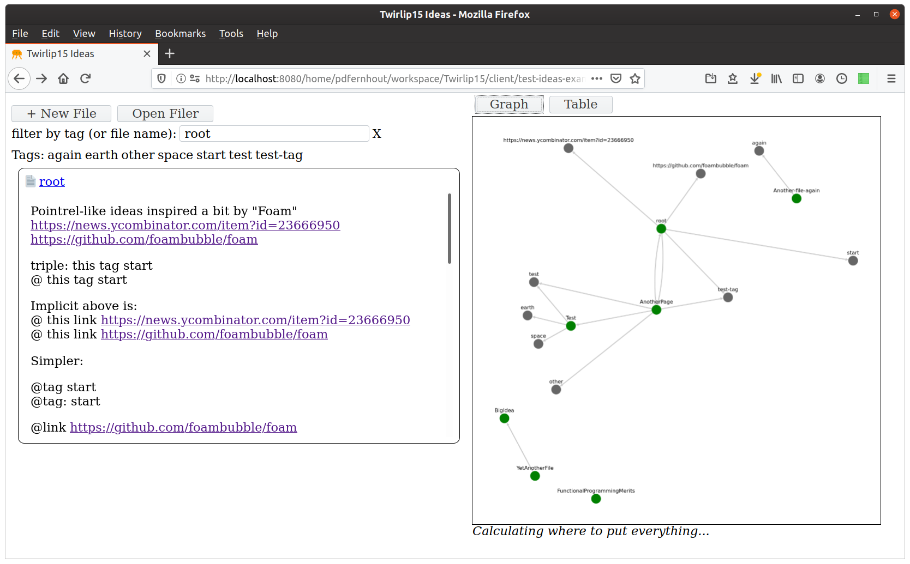
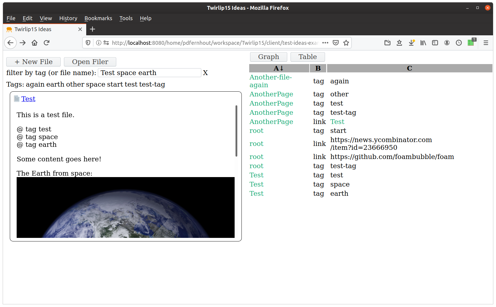
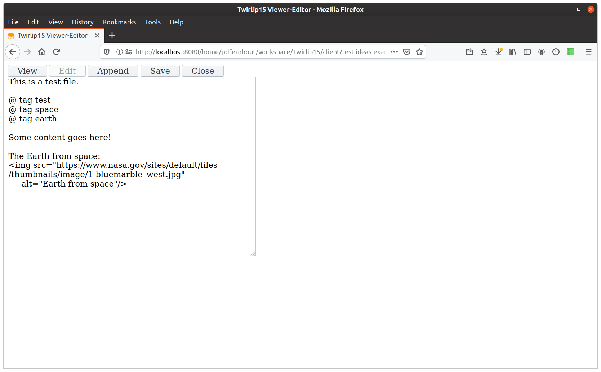

# Twirlip15 Information Organizer

Twirlip15 supports browsing and editing files on your local host -- like a simpler version of NextCloud. Another app is a step towards a personal knowledge management tool. Ideally more apps will be added over time -- including perhaps apps ported from Twirlip7.

Twirlip15 uses Node.js+Express for the server and Mithril+Tachyons for the UI.

Twirlip15 makes it easy to develop applications in Mithril which operate on local files. 

A Twirlip15 server is intended to be used locally by a single user or a small trusted group. 
Twirlip15 uses the approach of a trusted client which uses the equivalent of fs.write and directory-related file commands sent from the UI across the network to a server. 
Apps can (and ideally should) use only append-only transactions to preserve history.
However files and directories can be renamed, deleted, rewritten, and moved.

All files on your machine are accessible from "/" assuming the server process has file access permissions.
So, anyone who can access your server can potentially delete or change any file accessible on your machine.

WARNING: In general, you do not want to make your Twirlip15 server available to the public! Please consult appropriate guides on how to restrict access to servers on your network.

WARNING: Twirlip15 is currently pre-alpha software and is only appropriate for use by advanced users who know about computer networking and software development.

## Usage

You must have a recent version of Node.js (version >= 10) installed to use this software.

To setup the software, run this command from the main project directory:

    npm install

To start the server, run this command from the main project directory:

    node server/twirlip15-server.js

Then browse to:

    http://localhost:8015

If you decide to open your server to the world via changing the code, https and basic auth are required. Use "node server/add-user.js" from top-level project folder to add users.

## Licence 

Twirlip 15 is under the MIT License

## Screenshots

#### Twirlip15 Filer with menu open

#### Twirlip15 Ideas with Graph of linked nodes

#### Twirlip15 Ideas with Table

#### Twirlip15 Editor

